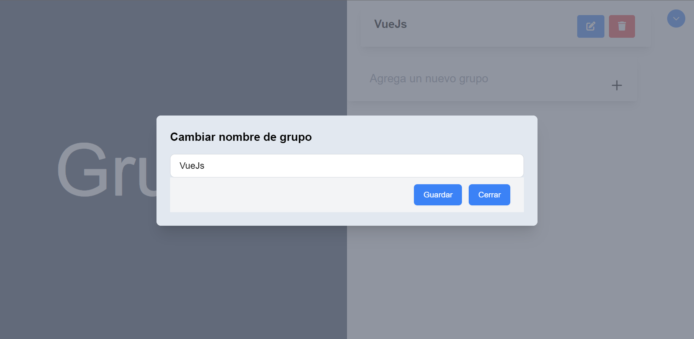

# Vue-and-flask-todoapp

# Requerimientos
* Python 3.10 o superior
* node.js 18.16.0 o similares

# Guía de instalación

1. Crear una base de datos sql según los lineamientos del modelo de la mase de datos:

2. En el archivo app.py en la capeta server, en la linea 12 reemplazar el valor que allí está estipulado por la URI de conexión a la base de datos creada

3. Ejecutar los siguientes comandos en la carpeta server:
  * python3 -m pip install -r requirements.txt
  * python index.py

4. Ejecutar los siguientes comandos en la carpeta client:
  * npm i
  * npm run serve

5. Abrir la ruta: http://localhost:8080

# Registro
Para iniciar sesión se debe estar registrado dentro de la aplicación, para ello en la Página de inicio se debe de dar click en "Regístrate aquí", y llenar los campos en el formulario

# Grupos
En esta sección aparecerán todos los grupos registrados en la base de datos, además de un formulario para agregar nuevos grupos, cada grupo trae su opción de editar el nombre del grupo o eliminarlo

# Tareas
En esta sesion se ven las tareas dentro de cada grupo, tambien pueden ser editadas o eliminadas

# Cierre de sesion
En todas las ventas ([Grupos](#grupos) y [Tareas](#tareas)), en la esquina superior derecha, hay un botón que desplegará la opción de cerrar sesión
